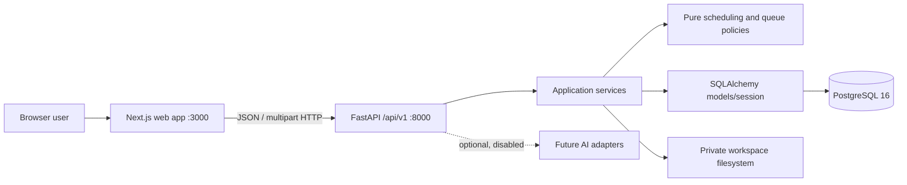
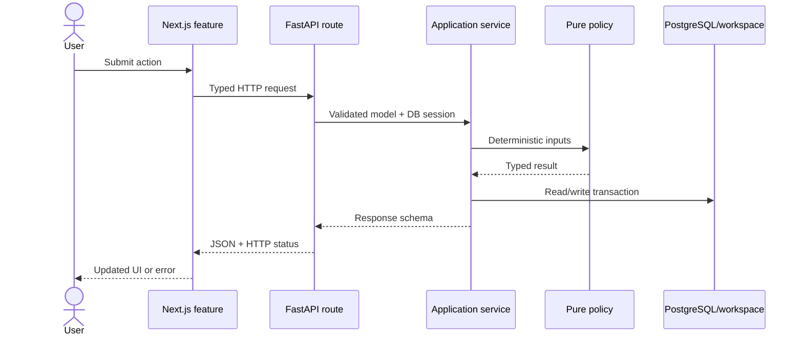

# CodeMuscle architecture

> Start here. This describes the implemented system through Milestone 7. The original plan remains
> in [the technical specification](CodeMuscle_Technical_Design_and_Implementation_Spec.md).

## Overview and goals

CodeMuscle is a private, deterministic coding-interview revision tracker. Users maintain a problem
library, import prior history, record immutable attempts, receive spaced-repetition dates, and build
time-bounded daily queues. AI is disabled and is not required for current behavior.

Design goals:

- Keep personal preparation data local and private.
- Make scheduling and recommendations deterministic, explainable, and testable.
- Keep business rules out of HTTP routes and React components.
- Preserve attempt, import, and queue history for auditability.
- Prefer a modular monolith until scale justifies separation.
- Keep future AI integrations optional and downstream of deterministic services.

## High-level architecture



The browser never connects directly to PostgreSQL or the workspace. FastAPI is the application
boundary. Services own transactions; pure policies calculate schedules and queue scores.

## Component responsibilities

| Component | Responsibility | Must not do |
|---|---|---|
| `apps/web/app` | Next.js routes and page shells | Implement scheduling or persistence rules |
| `apps/web/features` | Interactive workflows and UI state | Access PostgreSQL or workspace files |
| `apps/web/lib` | Typed HTTP clients | Duplicate backend business rules |
| `api/routes` | HTTP parsing, DI, response models | Contain business logic or commit transactions |
| `application/*/service.py` | Use cases, orchestration, transactions | Depend on React or transport state |
| `application/*/policy.py` | Pure deterministic calculations | Query databases or perform I/O |
| `application/*/schemas.py` | Pydantic contracts | Hold mutable ORM state |
| `infrastructure/database/models` | SQLAlchemy persistence mapping | Implement use cases |
| `domain` | Shared enums and domain errors | Import API or UI code |
| Alembic | Schema evolution | Change schema outside versioned migrations |

There is no repository layer today. Services query SQLAlchemy directly. Add repositories only when
query reuse, alternate persistence, or test isolation makes the extra abstraction valuable.

## Repository structure

```text
apps/
  api/
    alembic/versions/       Database migrations
    src/codemuscle/
      api/routes/           FastAPI adapters
      application/          Services, schemas, pure policies
      domain/               Enums and domain exceptions
      infrastructure/       SQLAlchemy models and sessions
    tests/unit/             Backend tests
  web/
    app/                    Next.js App Router pages
    features/               Problem, import, and queue workflows
    lib/                    HTTP clients and TypeScript types
    tests/                  Vitest/Testing Library tests
docs/                       Architecture and operational knowledge
scripts/codemuscle          Local lifecycle helper
```

## Technology stack

| Area | Technology |
|---|---|
| Web | Next.js, React, TypeScript, Tailwind CSS |
| API | Python 3.12+, FastAPI, Pydantic v2 |
| Persistence | PostgreSQL 16, SQLAlchemy 2, Psycopg 3, Alembic |
| Imports | Python CSV module, OpenPyXL |
| Tooling | `uv`, `pnpm`, Docker Compose, Make |
| Testing | Pytest, Hypothesis, Vitest, Testing Library |
| Quality | Ruff, Pyright, ESLint, TypeScript compiler |

See [ADR 0001](adr/0001-tech-stack.md) for rationale.

## Request lifecycle and data flow



- **Library:** UI → Problems API → `ProblemService` → normalized problems/topics/patterns.
- **Import:** file → private workspace copy → intermediate rows → preview/duplicate review → commit.
- **Attempt:** input → `AttemptService` → scheduling policy → immutable attempt and problem summary.
- **Queue:** request → `QueueService` → scoring/time-fit policy → persisted items and explanations.
- **Statistics:** read-only aggregates → classification policy → dashboard, area tables, and trends.

Detailed sequences are in [workflows.md](workflows.md).

## Authentication

There is **no authentication**. CodeMuscle is single-user software for a trusted local machine. CORS
accepts only configured `WEB_ORIGIN`; CORS is not authentication. Do not expose API or database ports
to an untrusted network. Multi-user deployment requires identity, authorization, tenant ownership,
and migration plans before exposure.

## Background jobs and caching

There are no background workers. Imports, scheduling, and queues execute synchronously. Add a job
system only for long-running exports, backups, or future model calls, and persist job state first.

There is no application cache. PostgreSQL is authoritative; React holds page-local state. Statistics
snapshots may be cached later, but must be invalidated after attempts/imports and never become truth.

## Error handling and logging

- Expected failures extend `DomainError` and return
  `{"error":{"code":"...","message":"...","details":{...}}}`.
- FastAPI/Pydantic validation returns HTTP 422.
- Missing problem, import, and queue resources return HTTP 404.
- Web clients translate non-2xx responses into user-facing errors.
- Uvicorn emits startup/access logs to stdout. Inspect with `docker compose logs -f api`.
- Never log imported contents, personal notes, secrets, or private workspace files.
- Future structured logs should contain request IDs, operation, entity IDs, duration, and counts.

## Important decisions and extension points

- Stack and modular monolith: [ADR 0001](adr/0001-tech-stack.md).
- PostgreSQL and immutable history: [ADR 0002](adr/0002-database-design.md).
- Deterministic scheduling: [ADR 0003](adr/0003-deterministic-scheduling.md).
- Persisted explainable queues: [ADR 0004](adr/0004-daily-queue.md).
- Deterministic statistics classification: [ADR 0005](adr/0005-statistics-classification.md).
- Import migrations `0004` and `0005` intentionally preserve removal/restoration history.

Statistics and weak-area classification are read-only and deterministic. Queue scoring can consume
these classifications in a future refinement. AI may summarize deterministic data or suggest
metadata, but must remain disabled by default, schema-validated, and explicitly approved before
persistence.

## Local operation

```bash
make start
make status
make logs
make stop
make test
make lint
```

Web: <http://localhost:3000>. OpenAPI: <http://localhost:8000/docs>.

Continue with [database.md](database.md), [api.md](api.md), [workflows.md](workflows.md),
[coding-guidelines.md](coding-guidelines.md), and [agent.md](agent.md).
