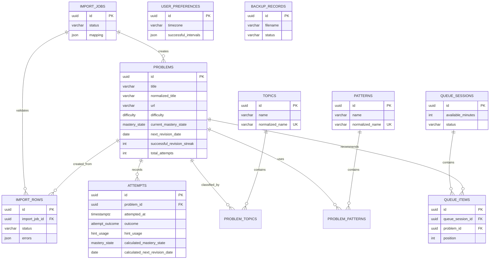

# Database reference

CodeMuscle uses PostgreSQL 16 through SQLAlchemy 2. UUIDs are application-generated primary keys.
Dates represent revision days; timezone-aware timestamps represent events. JSON stores variable
metadata, mappings, reasons, and configuration—not core relational identities.

## Entity relationship diagram



## Tables

### `problems`

Purpose: authoritative problem metadata plus the current denormalized revision summary.

| Column | Type | Null/default | Notes |
|---|---|---|---|
| `id` | UUID | PK | Application-generated |
| `title` | varchar(500) | not null | User-visible title |
| `normalized_title` | varchar(500) | not null | Duplicate/search key |
| `url`, `normalized_url` | varchar(2048) | nullable | Optional source URL and canonical form |
| `platform` | varchar(100) | nullable | Platform name |
| `platform_identifier` | varchar(255) | nullable | External problem identifier |
| `difficulty` | enum | not null, `UNKNOWN` | `EASY`, `MEDIUM`, `HARD`, `UNKNOWN` |
| `notes` | text | nullable | Personal notes |
| `priority` | integer | not null, 3 | Check: 1–5 |
| `date_added` | date | not null | Library entry date |
| `current_mastery_state` | enum | not null, `NEW` | Current calculated/overridden summary |
| `mastery_overridden` | boolean | not null, false | Reserved explicit override marker |
| `next_revision_date` | date | nullable | Effective date used by queues |
| `calculated_next_revision_date` | date | nullable | Latest policy result retained for audit |
| `next_revision_overridden` | boolean | not null, false | Distinguishes manual/effective date |
| `estimated_duration_minutes` | integer | nullable | Check: positive; queue defaults by difficulty |
| `successful_revision_streak` | integer | not null, 0 | Consecutive successful revisions |
| `total_attempts` | integer | not null, 0 | Denormalized attempt count |
| `import_job_id` | UUID FK | nullable | Traceability to `import_jobs.id` |
| `legacy_import_metadata` | JSON | nullable | Summary data that must not become fake attempts |
| `archived_at` | timestamptz | nullable | Null means active |
| `created_at`, `updated_at` | timestamptz | not null | Audit timestamps |

Indexes: normalized title, normalized URL, next revision date, mastery state, archive timestamp, and
import job. Relationships: many-to-many topics/patterns; one-to-many attempts and queue items.

### `topics` and `patterns`

Purpose: normalized reusable classifications. Each has `id UUID PK`, `name varchar(255) NOT NULL`,
`normalized_name varchar(255) NOT NULL UNIQUE`, and `created_at timestamptz NOT NULL`.

`problem_topics` and `problem_patterns` are association tables with composite primary keys
`(problem_id, topic_id|pattern_id)`. Both foreign keys use `ON DELETE CASCADE`, so removing either
side removes only the association.

### `attempts`

Purpose: immutable chronological practice events and a snapshot of each scheduling decision.

| Column | Type | Null | Notes |
|---|---|---|---|
| `id` | UUID PK | no | Event ID |
| `problem_id` | UUID FK | no | References `problems`; delete restricted |
| `attempted_at` | timestamptz | no | User event time |
| `outcome` | enum | no | Independent/small hint/significant help/understood/failed/skipped |
| `hint_usage` | enum | no | None/small/significant/solution/not applicable |
| `time_spent_minutes` | integer | yes | Check: nonnegative |
| `notes` | text | yes | Attempt-specific notes |
| `previous_mastery_state` | enum | no | State before event |
| `calculated_mastery_state` | enum | no | Policy result |
| `previous_revision_date` | date | yes | Effective date before event |
| `calculated_next_revision_date` | date | no | Policy result |
| `schedule_explanation` | text | no | Human-readable deterministic explanation |
| `created_at` | timestamptz | no | Persistence timestamp |

Indexes: `problem_id` and `(problem_id, attempted_at)`. Attempts are append-only through normal APIs.

### `import_jobs`

Purpose: uploaded file lifecycle and aggregate preview counts. Columns: `id UUID PK`, original/stored
filenames `varchar(500)`, `status varchar(50)`, `headers JSON`, `mapping JSON`, total/valid/invalid/
duplicate integer counts, and created/updated timestamps. One job owns many rows with delete cascade.

### `import_rows`

Purpose: row-level staging, validation, correction, duplicate review, and traceability. Columns:
`id UUID PK`, `import_job_id UUID FK`, `row_number integer`, `raw_data JSON`, nullable `parsed_data JSON`,
`errors JSON`, `duplicate_problem_ids JSON`, `status varchar(50)`, nullable `created_problem_id UUID FK`,
nullable `retry_notes text`. Index: `import_job_id`. Deleting a job cascades its rows; deleting a
created problem is not configured to cascade through traceability.

### `queue_sessions`

Purpose: persisted generation request. Columns: `id UUID PK`, `available_minutes integer NOT NULL`,
`topic_focus_ids JSON NOT NULL`, nullable `requested_problem_count integer`, `status varchar(30)`, and
`created_at timestamptz`. Deleting a session cascades its items.

### `queue_items`

Purpose: immutable-at-generation recommendation details plus mutable workflow status. Columns:
`id UUID PK`, `queue_session_id UUID FK`, `problem_id UUID FK`, `position integer`,
`estimated_duration_minutes integer`, `recommendation_score float`, `recommendation_reasons JSON`,
`status varchar(30)`, and `created_at`. Index: `(queue_session_id, position)`. Problem deletion is
restricted. Remove/postpone/complete update status; normal remove does not destroy history.

### `user_preferences`

Purpose: singleton local-user settings. Columns: `id UUID PK`, nullable `workspace_path varchar(2048)`,
`timezone varchar(100)`, `default_available_minutes integer`, `successful_intervals JSON`, and audit
timestamps. Intervals are validated as unique ascending days between 1 and 3650.

### `backup_records`

Purpose: metadata for versioned ZIP backups. Columns: `id UUID PK`,
`filename varchar(500)`, `manifest_version integer`, `application_version varchar(50)`,
`status varchar(50)`, and `created_at`. The archive itself lives in the private workspace `backups/`
directory. A backup database snapshot includes this table so restore also restores backup metadata.

## Enums

- `difficulty`: `EASY`, `MEDIUM`, `HARD`, `UNKNOWN`.
- `mastery_state`: `NEW`, `LEARNING`, `FRAGILE`, `RETAINED`, `MASTERED`,
  `NEEDS_RELEARNING`, `ARCHIVED`.
- `attempt_outcome`: `SOLVED_INDEPENDENTLY`, `SOLVED_SMALL_HINT`,
  `SOLVED_SIGNIFICANT_HELP`, `UNDERSTOOD_AFTER_SOLUTION`, `FAILED`, `SKIPPED`.
- `hint_usage`: `NONE`, `SMALL`, `SIGNIFICANT`, `SOLUTION_VIEWED`, `NOT_APPLICABLE`.

## Lifecycle and cascade rules

- Archiving a problem sets `archived_at`; it does not delete history.
- Attempts and queue items restrict problem deletion. There is no normal delete-problem API.
- Topic/pattern associations cascade when either parent is deleted.
- Import rows cascade with their job; imported problems keep `import_job_id` traceability.
- Queue items cascade only when their queue session is deleted; UI removal changes status.
- Private uploaded files live outside PostgreSQL in the configured workspace `imports/` directory.

## Migration strategy

Alembic revisions are linear and committed with schema changes. Run:

```bash
make migrate
uv run --project apps/api alembic -c apps/api/alembic.ini current
```

Never edit a migration already applied to a shared/user database. Add a new revision. Verify both a
fresh upgrade path and upgrade from the previous head. Revisions `0004` and `0005` deliberately record
the removed/restored import workflow; do not collapse them. Back up user data before destructive
migrations. See [ADR 0002](adr/0002-database-design.md).
