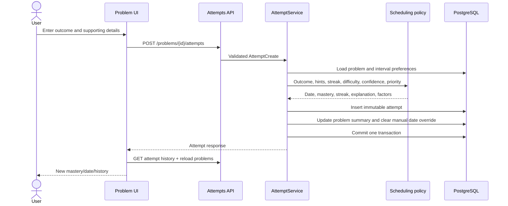
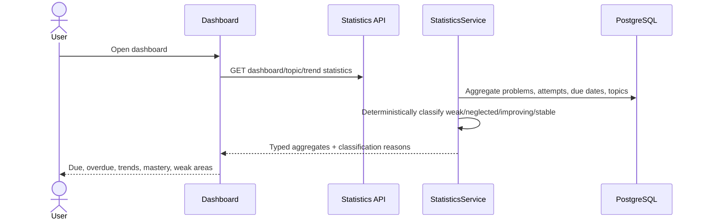
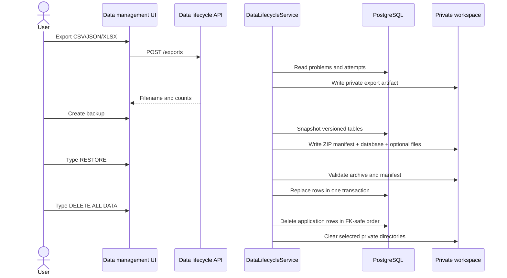
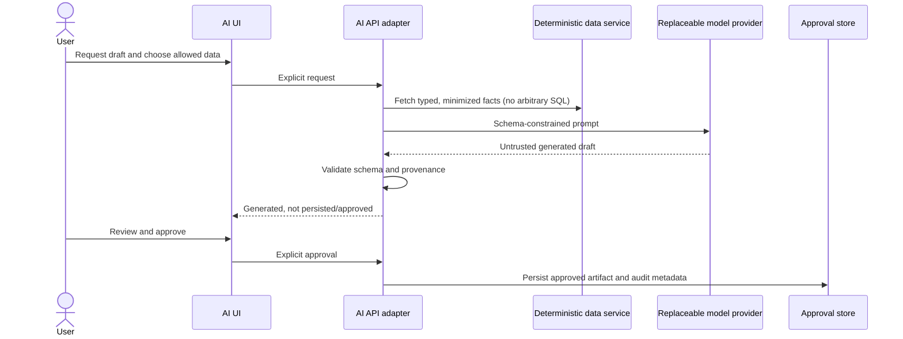

# Business workflows

This document explains user-visible behavior and the authoritative backend processing. Current
workflows are marked **implemented**; planned workflows describe extension contracts, not shipped UI.

## CSV or Excel import — implemented

```mermaid
sequenceDiagram
    actor U as User
    participant W as Import UI
    participant A as Imports API
    participant S as ImportService
    participant F as Private workspace
    participant D as PostgreSQL
    U->>W: Select CSV/XLSX
    W->>A: POST /imports (multipart)
    A->>S: Upload bytes
    S->>F: Store private copy
    S->>D: Create import_job
    S-->>W: Headers + suggested mapping
    U->>W: Adjust mapping, preview
    W->>A: PUT mapping; POST preview
    S->>S: Parse and validate each row
    S->>D: Store import_rows and duplicate candidates
    S-->>W: Valid/invalid/duplicate counts
    U->>W: Accept duplicates/corrections
    W->>A: POST commit or retry
    S->>D: Transactionally create accepted problems and mark rows
    S-->>W: Import summary
```

Important rules: invalid rows do not block valid rows; source values and errors remain reviewable;
duplicates are suggestions and can be accepted; retries do not recreate already imported rows; legacy
summary counts/dates remain metadata and never fabricate attempts.

## Recording an attempt and updating spaced repetition — implemented



### Scheduling rules

- `FAILED`: streak 0, `NEEDS_RELEARNING`, one day.
- `UNDERSTOOD_AFTER_SOLUTION`: streak 0, `LEARNING`, one day.
- Significant help: streak 0, `LEARNING`, short interval.
- Small hint: increment streak cautiously, `FRAGILE`, hold interval back one stage.
- Independent solve: increment streak and progress `LEARNING` → `RETAINED` → `MASTERED`.
- Skipped: preserve mastery/streak and keep due soon.
- Low confidence, hard difficulty, and priority 5 may shorten—but never lengthen—the base interval.
- Every calculation stores a plain-language explanation. Identical inputs are deterministic.

Default successful intervals are `3, 10, 30, 90, 180, 365` days and can be updated through settings.

## Manual revision-date override — implemented

```mermaid
sequenceDiagram
    actor U as User
    participant W as Edit problem UI
    participant A as Problems API
    participant D as PostgreSQL
    U->>W: Choose a next revision date
    W->>A: PUT /schedule-override
    A->>D: Set effective date and override=true
    Note over D: calculated_next_revision_date is preserved
    A-->>W: Updated problem
    U->>W: Select Use calculated date
    W->>A: DELETE /schedule-override
    A->>D: Copy calculated date to effective date; override=false
```

A later recorded attempt produces a new calculation and explicitly clears the old date override.

## Daily queue generation and editing — implemented

```mermaid
sequenceDiagram
    actor U as User
    participant W as Queue UI
    participant A as Queues API
    participant S as QueueService
    participant P as Queue policy
    participant D as PostgreSQL
    U->>W: Enter minutes, optional topic/count
    W->>A: POST /queues
    S->>D: Load active candidate problems and attempts
    S->>P: Score candidates
    P->>P: Diversify topics, then greedily fill by score
    P-->>S: Selected candidates with score/duration/reasons
    S->>D: Persist session and items
    S-->>W: Explainable queue
    U->>W: Add/remove/replace/postpone/complete
    W->>A: Queue item operation
    A->>D: Update item; preserve history
    A-->>W: Entire refreshed queue
```

Duration defaults are Easy 20, Medium 35, Hard 50, Unknown 30 minutes unless the problem has an
explicit estimate. Selection never exceeds available time. Severe overdue/failed items are considered
before topic diversity. Postpone sets a visible one-day manual revision override. Complete currently
marks the queue item; recording the actual attempt remains a separate explicit action.

## Problem lifecycle — implemented

1. User creates a problem; title is required and link is optional.
2. Names are normalized and topic/pattern rows are reused case-insensitively.
3. Duplicate lookup checks normalized URL, platform identifier, exact title, then fuzzy title.
4. Edits update metadata; attempts remain immutable.
5. Archive sets `archived_at`, excluding the problem from normal lists and queues.
6. Restore clears `archived_at`. There is no normal hard-delete endpoint.

## Dashboard statistics and weak-area detection — implemented



Statistics derive from active problems and immutable attempts and never mutate scheduling. Current
classification thresholds are:

- `NEGLECTED`: no attempts, or no practice for at least 30 days.
- `WEAK`: at least three attempts and either independent success below 50% or failure at least 35%.
- `IMPROVING`: at least four attempts, no weak condition, and recent success improves by at least 20
  percentage points over the older half of attempts.
- `STABLE`: none of the above.

Topic and pattern results include explanations, due/overdue counts, mastery distribution, and recent
trend. Dashboard practice-this-week counts distinct problems attempted since Monday. Trend endpoints
return explicit zero-value weeks so charts do not imply missing data.

## Export, backup, restore, and deletion — implemented



Restore never accepts an unsupported manifest or incomplete snapshot. Database replacement is one
transaction; optional workspace files are restored after validation but filesystem writes cannot share
the PostgreSQL transaction. Deletion preserves backup files by default and reports exactly which
directories were cleared. Tests use temporary fictional workspaces only.

## Future AI resume generation — planned, not implemented



Requirements before implementation: AI remains disabled by default; secrets stay outside source and
exports; only minimized approved data leaves the machine; generated output is labeled and not accepted
until user approval; adapters cannot access arbitrary SQL; failure never blocks deterministic features.
